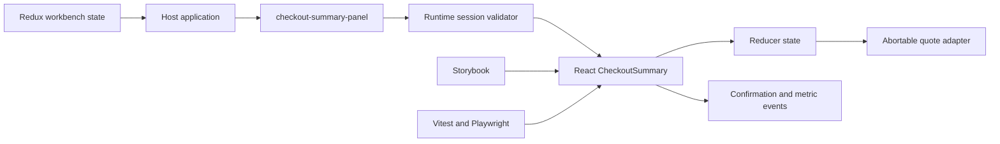

# Checkout Elements Web Components

[](https://github.com/Praharsh-Projects/checkout-elements-web-components/actions/workflows/ci.yml)

An accessible React and TypeScript component workbench for a checkout summary
that can run inside a React application or as a framework-neutral custom
element. The repository focuses on reusable component boundaries, semantic
HTML, runtime input validation, explicit async state, documentation, and
repeatable front-end quality gates.

## Implemented behavior

- React 19 checkout summary with typed sessions, line items, localized labels,
  and currency formatting.
- `checkout-summary-panel` Web Component with open Shadow DOM for non-React
  host applications.
- Redux Toolkit state coordinates locale and failure controls across the React
  and Web Component preview surfaces.
- Reducer-driven loading, ready, and error states around an abortable quote
  request.
- Runtime validation for JSON attributes, supported locales/currencies, bounded
  text, quantities, item counts, and monetary values.
- Composed `checkout:confirm`, `checkout:metric`, and `checkout:error` events.
- Monitoring hook reports only outcome and duration; it does not include
  session IDs, item names, or monetary values.
- Responsive HTML/CSS, semantic list and definition-list structure, live status
  text, alert states, 44-pixel action target, and visible keyboard focus.

## Front-end tooling

- React 19, TypeScript, Redux Toolkit, Vite, HTML, and CSS.
- Storybook with accessibility checks for documented component states.
- Vitest, Testing Library, and axe-core for unit, integration, custom-element,
  state, contract, and accessibility checks.
- Playwright with axe-core for desktop and mobile browser regression.
- ESLint, strict TypeScript, production and Storybook builds, dependency audit,
  and GitHub Actions CI.

## Architecture



The workbench uses two state-management levels deliberately. Redux Toolkit
coordinates preview preferences shared by the React and Web Component surfaces.
Each embedded checkout instance keeps its request and quote in a local reducer,
so independent host instances are not coupled through a global store.
The rationale and rejected alternatives are recorded in
[`docs/decisions/0001-state-and-monitoring-boundaries.md`](docs/decisions/0001-state-and-monitoring-boundaries.md).

## Run locally

Requires Node.js 24 and npm 11.

```bash
npm ci
npm run dev
```

Open `http://127.0.0.1:5173`.

Component documentation:

```bash
npm run storybook
```

## Verify

```bash
npm run quality
npx playwright install chromium
npm run test:e2e
```

`npm run quality` runs linting, strict TypeScript checks, coverage-enforced
Vitest suites, the production build, the static Storybook build, and the
high-severity dependency gate. GitHub Actions runs the same checks and the
desktop/mobile Playwright regression on pushes and pull requests.

Latest verified local snapshot:

- 17 Vitest checks passed across 7 files.
- Coverage reached 95.90% statements, 90.78% branches, 95.34% functions, and
  95.76% lines.
- Production and static Storybook builds completed.
- 2 Playwright workflows passed on desktop and mobile Chromium with rendered
  axe-core checks and no horizontal overflow.
- `npm audit` reported zero known vulnerabilities.

## Framework-neutral embed

```html
<checkout-summary-panel
  session='{"sessionId":"cko_1028","merchantName":"Nordic Home Goods","locale":"sv-SE","currency":"SEK","country":"SE","shippingCents":4900,"taxCents":2850,"items":[{"id":"sku-lamp-01","name":"Desk lamp","quantity":1,"amountCents":59900}]}'
></checkout-summary-panel>
```

Integration events:

```text
checkout:confirm  -> validated quote
checkout:metric   -> { name, outcome, durationMs }
checkout:error    -> bounded validation error
```

## Project structure

```text
.storybook/              Storybook and accessibility configuration
e2e/                     Desktop/mobile browser regression
src/
  api/                   Abortable quote adapter
  components/            React UI and Storybook stories
  elements/              Web Component registration and events
  state/                 Redux workbench state and local reducer transitions
  validation/            Runtime attribute contract
  i18n/                  Localized labels
tests/                   Unit, integration, state, contract, and axe checks
.github/                 CI and pull-request review template
```

## Evidence boundaries

This is a portfolio application with deterministic sample data. It is not a
payment processor or production checkout system and does not claim merchant
traffic, conversion lift, customer data, WCAG certification, production
observability, or peer code-review experience. The metric event is an
integration point for a host monitoring tool; it is not a New Relic or Sentry
deployment.
