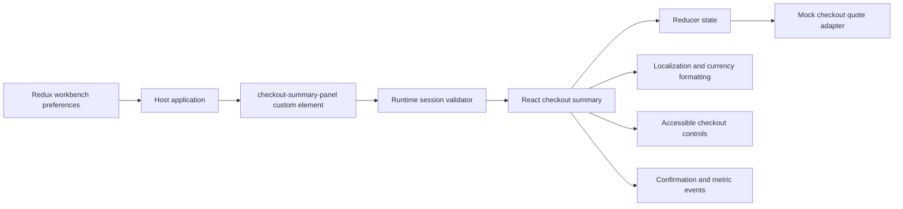

# Architecture

This project models a checkout UI surface with two integration modes:

- React application components for a controlled checkout surface.
- A Web Component wrapper for merchant storefronts that do not run React.

The custom element accepts a serialized checkout session through a `session`
attribute, renders in Shadow DOM, and dispatches a `checkout:confirm` event when
the user confirms the payment step. Invalid input produces an accessible error
and a bounded `checkout:error` event rather than silently casting arbitrary JSON.
The API module simulates async quote loading, error handling, and abort handling
without external services.

Redux Toolkit coordinates the locale and simulated-failure preferences shared
by the React and Web Component previews. The checkout component uses a local
reducer because each custom-element instance owns an isolated request and quote.
This separates shared host state from instance-specific async state. The host
can connect `checkout:metric` events to its chosen monitoring service; emitted
metrics exclude checkout-session data.
